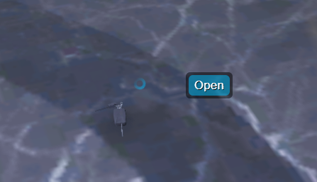

# Interaction

Register an interact object. An interact object is anything that the player will interact with. They are presented to the player with a menu on the center of the screen when available. Multiple interacts can be registered independently and will be seamlessly listed within the menu. The user may scroll to navigate and middle mouse click to select. These options are listed under the FiveM keybinds and may be changed.

## Exports

### Registering

```Lua
local id = exports.interact:Register({
	text = "Option Parent", -- The text to display.
	event = "", -- Triggers an event when used.
	entity = nil, -- Entity handle to register the interactable.
	coords = nil, -- Position for an arbitrary shape.
	radius = 0.0, -- Size of the sphere shape.
	model = nil, -- Model hash to register the interactable.
	embedded = {} -- A list of embedded interacts, same as above but requires id.
})
```

### Destroying

```Lua
exports.interact:Destroy(id)
```

### Updating

```Lua
exports.interact:Set(id, key, value)
```

## Images
### A sphere interact arbitrarily placed to open containers:
